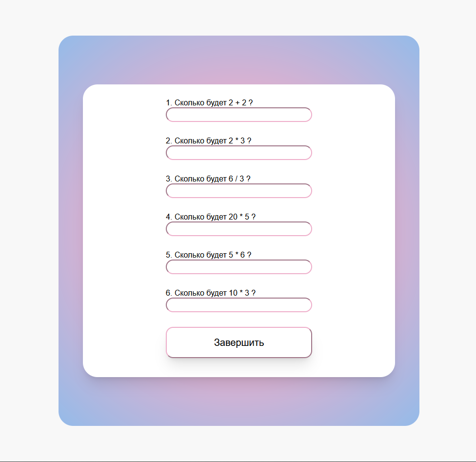

# Тест

### Простой пример теста по математике. 
Он состоит из HTML-страницы с несколькими вопросами,
JavaScript для проверки правильности ответов и CSS для стилизации интерфейса. Пользователи 
вводят свои ответы на вопросы, а затем нажимают кнопку, чтобы увидеть, сколько ответов они 
дали правильно.

